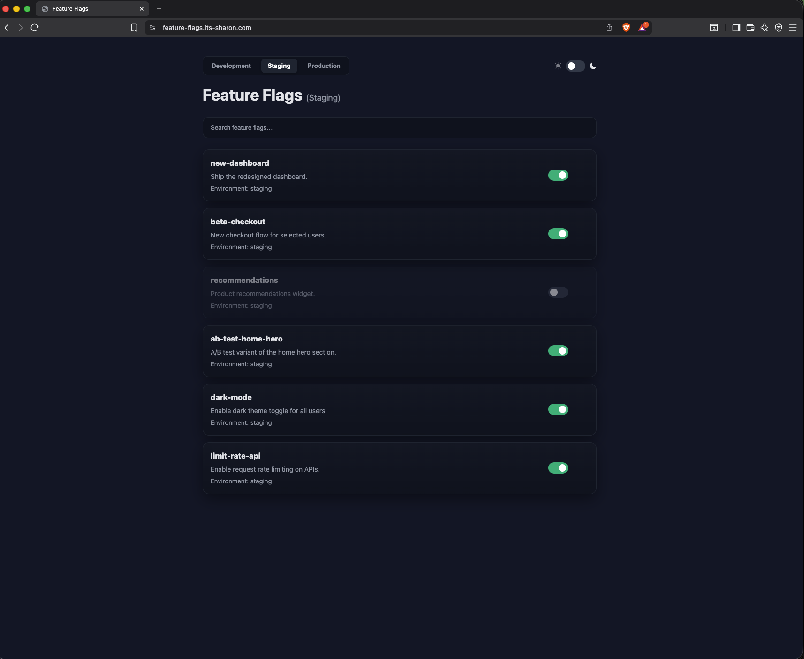
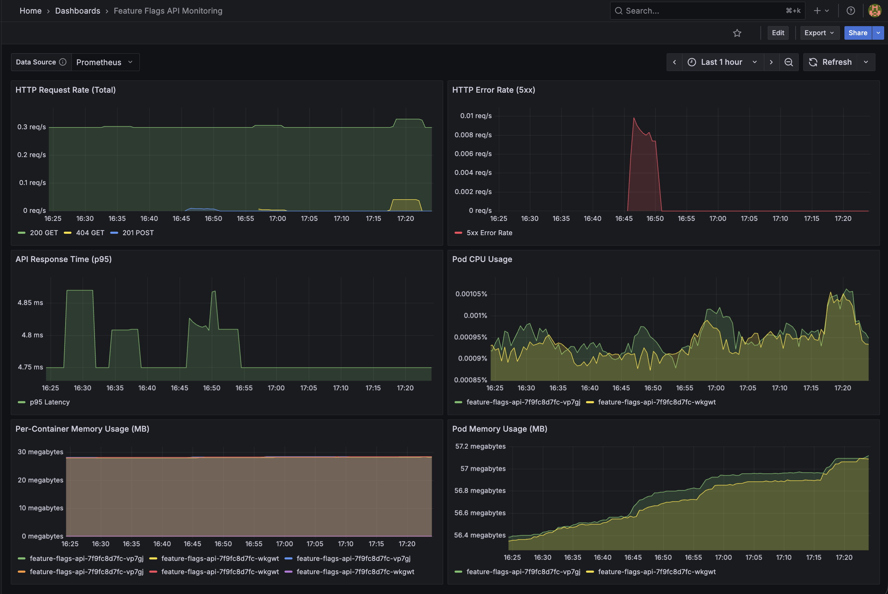

# Feature Flags App

A lightweight **Feature Flags App** built with **Python** (**Flask**), **MongoDB** and a frontend using HTML, CSS, and JavaScript.

This app lets you create, update, toggle, and delete feature flags across multiple environments (`development`, `staging`, `production`).  



### Repositories Structure
This project is split into three repositories, each with a specific role in the deployment and delivery workflow:

 1. **Application** Repository **([feature-flags-app](https://github.com/shaarron/feature-flags-app#))** **<--Current Repo**
     * Contains the Feature Flags API & UI 
     * Contains the GitHub Actions workflows to build the feature-flags-app image & sync frontend s3 bucket 

2. **Infrastructure** Repository **([feature-flags-infrastructure](https://github.com/shaarron/feature-flags-infrastructure))**  
   * Contains Terraform code for provisioning the required AWS resources (VPC, EKS, S3, CloudFront, Route53, etc.).
   * Contains the GitHub Actions workflow to apply the terraform
3. **Resources** Repository **([feature-flags-resources](https://github.com/shaarron/feature-flags-resources))** 
   * Holds Helm charts and Argo CD Applications that define the Kubernetes manifests. 
   * Implements GitOps: Argo CD watches this repo and syncs changes to the EKS cluster.


  
## Table of Contents

  - [**Github Actions**](#github-actions)
    - [Feature Flags CI](#feature-flags-ci)
    - [Feature Flags CD](#feature-flags-cd)
    - [Sync Frontend to S3](#sync-frontend-to-s3)
    - [Reusable Tests](#reusable-tests)
    - [Required Secrets & Variables](#required-secrets--variables)

  - [**Architecture**](#architecture)
    - [Service Architecture](#service-architecture)
    - [Full Flow Architecture](#full-flow-architecture)
    - [VPC Architecture](#vpc-architecture---high-availability)
    - [Docker Compose Architecture](#docker-compose-architecture)


  - [**Observabillity**](#observabillity)
    - [Monitoring](#monitoring)
    - [Logging](#logging)
  - [**Running locally**](#running-locally)
    - [Using Docker Compose](#using-docker-compose)
    - [Running app as a standalone](#running-app-as-a-standalone-no-db-using-python-virtual-environment)
  - [**API Documentation**](#api-documentation)
## Github Actions

### [Feature Flags CI](.github/workflows/ci.yaml)
This GitHub Actions workflow automates testing and building of the **Feature Flags API** Docker image.

### [Feature Flags CD](.github/workflows/cd.yaml)
This GitHub Actions workflow automates testing, versioning and publishing of the **Feature Flags API** Docker image to **AWS Elastic Container Registry (ECR)** & GitHub Container Registry (**GHCR**).


### [Sync Frontend to S3](.github/workflows/s3-frontend-sync.yaml)

This workflow detects changes in frontend dir (on push to **[/frontend](/frontend))** and syncs the changes to the s3 bucket that holds those static files.

### [Reusable Tests](.github/workflows/reusable-tests.yaml)

This reusable workflow provides automated testing for the **Feature Flags API**, It includes:

- **Unit Test**: Starts the Flask app in a virtual environment and validates the `/flags` endpoint returns a 200 status code.
- **E2E Test**: Runs the full Docker Compose stack ([docker-compose.local.yaml](docker-compose.local.yaml)) with MongoDB and Nginx, then validates that the API returns properly structured feature flag data with required fields.

This workflow is designed to be called from other workflows using the `workflow_call` trigger.

### Required Secrets & Variables

To run these workflows, configure the following secrets and variables in your GitHub repository settings.

#### Required Secrets

Navigate to **Settings → Secrets and variables → Actions → Repository secrets**:

| Secret Name | Description | Used In |
|------------|-------------|---------|
| `OIDC_AWS_ROLE_ARN` | AWS IAM role ARN for OIDC authentication | [ci.yaml](.github/workflows/ci.yaml), [cd.yaml](.github/workflows/cd.yaml), [s3-frontend-sync.yaml](.github/workflows/s3-frontend-sync.yaml) |

**Note**: `GITHUB_TOKEN` is automatically provided by GitHub Actions and doesn't need manual configuration.

#### Required Variables

Navigate to **Settings → Secrets and variables → Actions → Repository variables**:

| Variable Name | Description | Example Value | Used In |
|--------------|-------------|---------------|---------|
| `AWS_REGION` | AWS region where resources are deployed | `ap-south-1` | [ci.yaml](.github/workflows/ci.yaml), [cd.yaml](.github/workflows/cd.yaml), [s3-frontend-sync.yaml](.github/workflows/s3-frontend-sync.yaml) |
| `ECR_REGISTRY` | AWS ECR registry URL | `888432181118.dkr.ecr.ap-south-1.amazonaws.com` | [ci.yaml](.github/workflows/ci.yaml), [cd.yaml](.github/workflows/cd.yaml) |
| `ECR_REPO` | ECR repository name | `feature-flags-api` | [ci.yaml](.github/workflows/ci.yaml), [cd.yaml](.github/workflows/cd.yaml) |
| `S3_FRONTEND_BUCKET_URL` | S3 bucket URL for frontend files | `s3://your-bucket-name` | [s3-frontend-sync.yaml](.github/workflows/s3-frontend-sync.yaml) |

#### AWS OIDC Configuration

Both workflows use AWS OIDC for authentication.

Create the oidc using terraform from `/oidc` directory in **[feature-flags-infrastructure](https://github.com/shaarron/feature-flags-infrastructure/tree/main)** repo

Or create it manually - for more details on setting up AWS OIDC with GitHub Actions, see the [AWS documentation](https://docs.github.com/en/actions/deployment/security-hardening-your-deployments/configuring-openid-connect-in-amazon-web-services).


## Architecture 

### Service Architecture 

**API**:
   - Acts as the core API server for managing feature flags.
   - Provides endpoints for creating, updating, toggling, and deleting feature flags.
   - Includes environment-specific configurations for `dev`, `staging`, `prod`.

 **MongoDB**:
   - Serves as the persistent storage for feature flags.

**Frontend**:
   - Static, Stored in S3 and served via CloudFront.

### Full Flow Architecture


### VPC Architecture - High Availability


## Observabillity 

The application comes with pre-configured dashboards (available in the [**feature-flags-resources**](https://github.com/shaarron/feature-flags-resources) Repository) to provide immediate insight into the application health.

### Monitoring


#### [**Grafana Dashboard**](https://github.com/shaarron/feature-flags-resources?tab=readme-ov-file#grafana-dashboard-feature-flags-api-monitoring)

The Grafana dashboard monitors the Feature Flags API by combining Flask application metrics with Kubernetes resource statistics to visualize traffic, performance, and system health. It tracks critical indicators such as HTTP request rates, 5xx error spikes, and p95 response latency, alongside pod CPU and memory usage to ensure optimal application stability.

  

### Logging 


#### [**Kibana Dashboard**](https://github.com/shaarron/feature-flags-resources?tab=readme-ov-file#kibana-dashboard-feature-flags-dashboard) 

 The Kibana dashboard provides a centralized view of log data to track high-level log volume, service activity, and error trends. It highlights 5xx errors and application exceptions, offering breakdowns by service to help identify noisy components and analyze error distributions across the infrastructure.


  


## Running locally

### Using Docker Compose

#### Docker Compose architecture 

The `docker-compose.yml` file orchestrates the following services:

   
- **app (Flask API)**:
  - Runs the Flask application inside a Python-based Docker container.
  - Exposes port `5000` internally for communication with Nginx.
  - Connects to **MongoDB** for persistence.

- **Mongodb**:
  - Stores feature flag configurations.
  - Runs on port 27017 inside the container.
  - Persists data on a mounted Docker volume (**db-data**).

- **Nginx**:
  - Acts as a reverse **proxy** for the Flask API.
  - Listens on port **80** of the host for external access.
  - Routes incoming requests to the Flask backend on port 5000.
  - Serves the static UI assets (index.html, app.js)

- **Networks**:
    - **app-network**: Connects **Nginx** ↔ **API**. 
    - **db-network**: Connects **API** ↔ **MongoDB**. 


- **Volumes**:
    - **db-data**: Ensures MongoDB data is persisted across container restarts.
    - **Config mounts** (./nginx.conf, ./static, ./templates) are shared with the Nginx service for configuration and static asset serving.


#### Instructions 
```bash
git clone https://github.com/shaarron/feature-flags-app.git

cd feature-flags-app


# Create environment file (optional - defaults will be used if not provided)
cat > .env << EOF
MONGO_INITDB_ROOT_USERNAME=
MONGO_INITDB_ROOT_PASSWORD=
EOF

# Start all services
docker compose -f docker-compose.local.yaml up -d
```

The application will be available at:
- **Web Interface**: http://localhost
- **API**: http://localhost/flags
- **MongoDB**: localhost:27017


### Running app as a standalone (no DB): Using Python Virtual Environment

```bash
git clone https://github.com/shaarron/feature-flags-app.git
cd feature-flags-app

# Create and activate virtual environment
python3 -m venv venv
source venv/bin/activate 

# Install dependencies
pip install -r requirements.txt

# Run the application
python app.py
```

The application will be available at http://localhost:5000


## API Documentation

### Endpoints
  
#### 1. Create a Feature Flag
```
POST /flags 
```
##### Request Body:

```sh
{
  "name": "dark-mode",
  "description": "Enable dark theme for all users",
  "environments": {
    "development": true,
    "staging": true,
    "production": false
  }
}
```
**Response (201)
**
```sh
{
  "_id": "abc123",
  "name": "dark-mode",
  "description": "Enable dark theme for all users",
  "environments": {...}
}
```

#### 2. Get All Flags

```
GET /flags?environment=staging
```

Retrieves all feature flags, with an `enabled` field for the selected environment.

**Response**
```sh
[
  {
    "_id": "abc123",
    "name": "dark-mode",
    "description": "Enable dark theme for all users",
    "environments": {...},
    "enabled": true
  }
]
```

#### 3. Get a Single Flag
```
GET /flags/<id>
```

Fetches a specific feature flag by ID.

**Response**
```sh
{
  "_id": "abc123",
  "name": "dark-mode",
  "description": "Enable dark theme for all users",
  "environments": {...}
}
```

##### 4. Update a Flag
```
PUT /flags/<id>
```
Updates name, description, or environment states.

**Request Body** (partial update allowed):
```sh
{
  "description": "Enable dark mode toggle for users"
}
```

 **Response**
```sh
{
  "_id": "abc123",
  "name": "dark-mode",
  "description": "Enable dark mode toggle for users",
  "environments": {...}
}
```

##### 5. Delete a Flag
```
DELETE /flags/<id>
```
Deletes a feature flag.

**Response (204):**
```sh
{
  "message": "Feature flag deleted"
}
```

#### 6. Toggle a Flag
```
POST /flags/<id>/toggle
```
Toggles a flag’s enabled state in a given environment.

**Request Body:**
```sh
{
  "environment": "production"
}
```

**Response (200)**
```sh
{
  "_id": "abc123",
  "name": "dark-mode",
  "enabled": true
}
```


